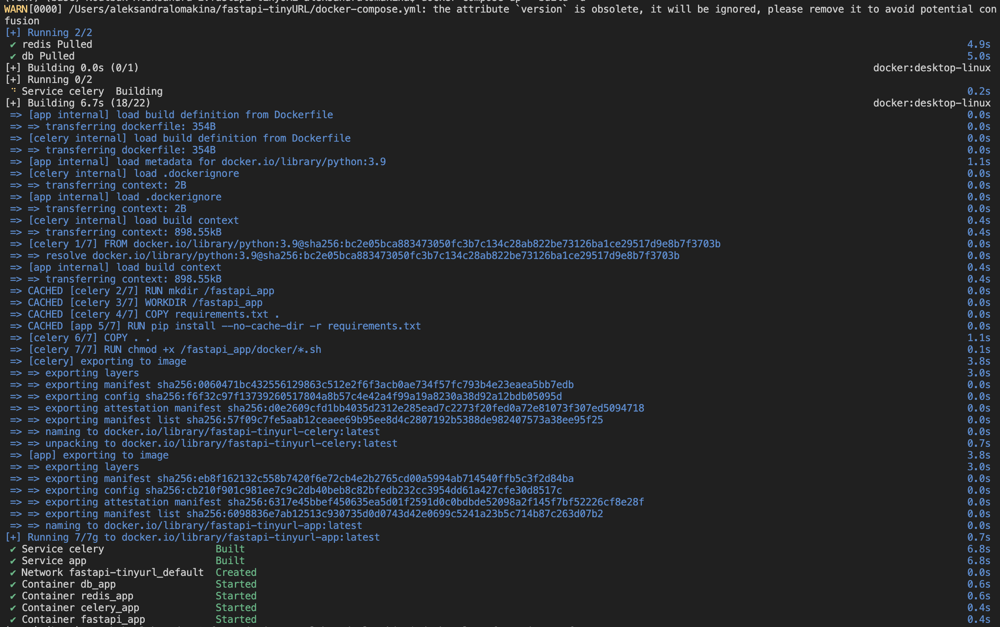
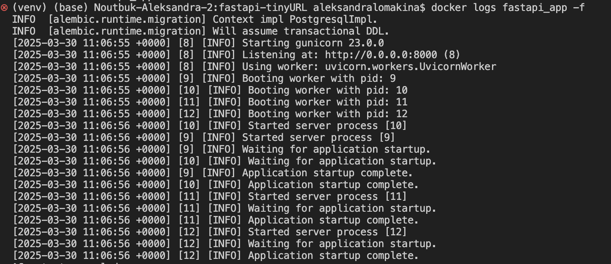
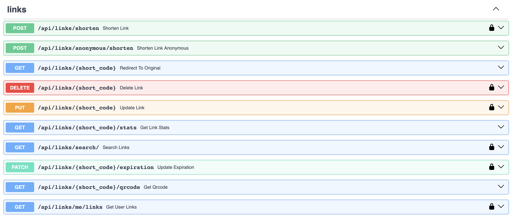
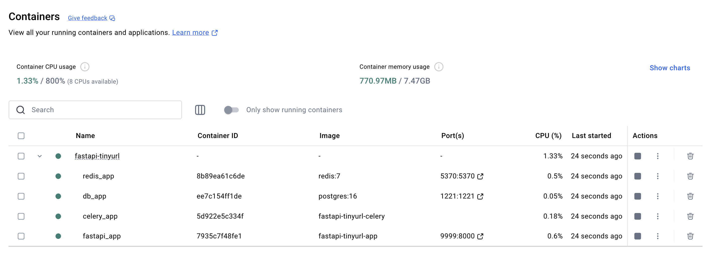

# URL Shortener API

API для сокращения ссылок с возможностью управления ими. Поддерживает регистрацию пользователей, создание, удаление, обновление и просмотр статистики коротких ссылок.

## 🚀 Функциональность
- Создание коротких ссылок для зарегистрированных и незарегистрированных пользователей
- Поддержка кастомных alias
- Поиск ссылки по оригинальному URL
- Указание времени жизни ссылки
- Получение статистики переходов
- Кэширование популярных ссылок через Redis
- Генерация QR-кодов для коротких ссылок
- Удаление неиспользуемых ссылок спустя N дней после последнего перехода

## 📡 Примеры API-запросов

### 1. Создание короткой ссылки
#### Запрос:
```http
POST /links/shorten
```
```json
{
  "original_url": "https://example.com",
  "custom_alias": "myalias",
  "expires_at": "2025-12-31T23:59:59"
}
```
#### Ответ:
```json
{
  "short_code": "myalias",
  "original_url": "https://example.com"
}
```

### 2. Перенаправление по короткой ссылке
#### Запрос:
```http
GET /links/{short_code}
```
#### Ответ:
302 Redirect на оригинальный URL

### 3. Получение статистики по ссылке
#### Запрос:
```http
GET /links/{short_code}/stats
```
#### Ответ:
```json
{
  "original_url": "https://example.com",
  "created_at": "2025-01-01T12:00:00",
  "visit_count": 15,
  "last_visited_at": "2025-03-30T15:20:00"
}
```

## 🛠 Инструкция по запуску
### 1. Установка зависимостей
```sh
pip install -r requirements.txt
```

### 2. Настройка окружения
Создайте файл `.env` и укажите переменные

### 3. Запуск сервера
```sh
docker-compose up --build -d
```
### 4. Проверка работы
```sh
docker logs fastapi_app -f
```

## 🗄️ Описание БД
### Таблица `users`
| Поле          | Тип данных   | Описание                        |
|--------------|------------|--------------------------------|
| id          | UUID        | Уникальный идентификатор      |
| email       | TEXT        | Email пользователя (уникальный) |
| hashed_password | TEXT    | Захешированный пароль         |
| registered_at | TIMESTAMP  | Дата регистрации пользователя |
| is_active   | BOOLEAN     | Флаг активности пользователя  |
| is_superuser | BOOLEAN    | Флаг суперпользователя        |
| is_verified | BOOLEAN     | Флаг верификации пользователя |

### Таблица `links`
| Поле          | Тип данных   | Описание                        |
|--------------|------------|--------------------------------|
| id          | BIGINT      | Уникальный идентификатор      |
| original_url| TEXT        | Исходный URL                  |
| short_code  | VARCHAR(10) | Уникальный короткий код       |
| created_at  | TIMESTAMP   | Дата создания                 |
| expires_at  | TIMESTAMP   | Время истечения (если есть)   |
| custom_alias| VARCHAR(50) | Кастомный алиас (если задан)  |
| user_email  | TEXT        | Email владельца (может быть NULL) |

### Таблица `stats`
| Поле           | Тип данных  | Описание                          |
|---------------|------------|----------------------------------|
| id           | BIGINT      | Уникальный идентификатор        |
| link_id      | BIGINT      | ID ссылки                        |
| visit_count  | INTEGER    | Количество переходов            |
| last_visited_at | TIMESTAMP | Дата последнего перехода       |


## 📄 Документация API
После запуска сервера документация доступна по адресу:
- **Swagger UI**: [http://localhost:8000/docs](http://localhost:9999/docs)

---
🔗 **Разработано на FastAPI с поддержкой PostgreSQL и Redis**

## Подтверждение работы сервиса:







